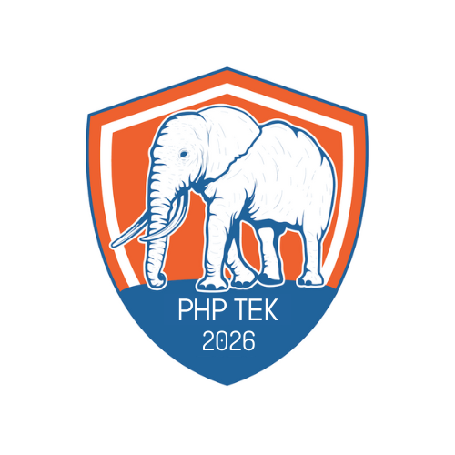

# PHP Tek 2026 Conference Website

This repository contains the official website for the PHP Tek 2026 conference, a premier event for PHP and web
development professionals.

## About the Project

PHP Tek 2026 is a web application built with Laravel that serves as the official website for the PHP Tek conference
scheduled for May 19-21, 2026. The website provides information about the conference, venue details, and will eventually
support features like registration, speaker submissions, and schedule management.

## Technologies Used

- **PHP 8.2+**
- **Laravel 10.x** - PHP Framework
- **MySQL/MariaDB** - Database
- **Tailwind CSS** - Styling
- **Vite** - Frontend build tool
- **Livewire** - Interactive components

## Prerequisites

Before you begin, ensure you have the following installed:

- PHP 8.2 or higher
- Composer
- Node.js and npm
- MySQL or MariaDB
- Git

## Installation

1. Clone the repository:
   ```bash
   git clone https://github.com/yourusername/phptek-2026.git
   cd phptek-2026
   ```

2. Install PHP dependencies:
   ```bash
   composer install
   ```

3. Install JavaScript dependencies:
   ```bash
   npm install
   ```

4. Create a copy of the environment file:
   ```bash
   cp .env.example .env
   ```

5. Generate an application key:
   ```bash
   php artisan key:generate
   ```

## Configuration

1. Open the `.env` file and configure your database connection:
   ```
   DB_CONNECTION=mysql
   DB_HOST=127.0.0.1
   DB_PORT=3306
   DB_DATABASE=phptek_2026
   DB_USERNAME=your_username
   DB_PASSWORD=your_password
   ```

2. Configure any other environment-specific settings in the `.env` file.

## Database Setup

1. Create a database for the application:
   ```bash
   mysql -u root -p
   CREATE DATABASE phptek_2026;
   exit;
   ```

2. Run database migrations:
   ```bash
   php artisan migrate
   ```

3. Seed the database with initial data:
   ```bash
   php artisan db:seed
   ```

## Running the Application

1. Compile assets:
   ```bash
   npm run dev
   ```

2. Start the development server:
   ```bash
   php artisan serve
   ```

3. Visit `http://localhost:8000` in your browser to view the application.

## Testing

The application includes feature tests for the Conference model and other components.

Run the tests with:

```bash
php artisan test
```

To run specific test files:

```bash
php artisan test --filter=ConferenceModelTest
```

## Project Structure

- **app/** - Contains the core code of the application
    - **Models/** - Database models including the Conference model
    - **Http/Controllers/** - Request handlers
- **config/** - Configuration files
- **database/**
    - **migrations/** - Database structure
    - **seeders/** - Seed data for the database
- **resources/**
    - **views/** - Blade templates
    - **css/** - Stylesheets
    - **js/** - JavaScript files
- **routes/** - Application routes
- **tests/** - Automated tests

## Key Features

- Dynamic conference information display
- Formatted date ranges
- Venue information
- Responsive design for mobile and desktop

## Contributing

1. Fork the repository
2. Create a feature branch: `git checkout -b feature/your-feature-name`
3. Commit your changes: `git commit -m 'Add some feature'`
4. Push to the branch: `git push origin feature/your-feature-name`
5. Open a pull request

## License

This project is licensed under the MIT License - see the LICENSE file for details.

## Contact

For questions or support, please contact the conference organizers at info@phptek.io.
